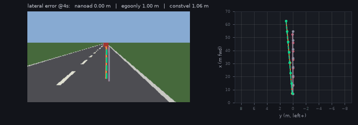

# nanoAD

**Train an end-to-end driving planner in 10 minutes on a laptop GPU. No dataset, 1,500 lines.**

Then train the same model blindfolded, and see what the standard metric makes of it.
Then put the same checkpoint behind the wheel and see if it can actually drive.



*Orange is nanoAD. Green dashed is the expert it is imitating. Pink is the same
model with the camera removed; grey has no parameters at all. Watch what happens
on the bends.*

---

## Quick start

The whole journey, five commands:

```bash
python test_geometry.py                                    # 5 s -- the world's maths is correct
python train.py --compare                                  # ~10 min -- train nanoad + egoonly + constvel
python viz.py runs/nanoad/ckpt.pt runs/egoonly/ckpt.pt --out docs/preds.png
python animate.py runs/nanoad/ckpt.pt runs/egoonly/ckpt.pt --out docs/hero.gif
python drive.py runs/nanoad/ckpt.pt runs/egoonly/ckpt.pt    # ~1.5 min -- closed loop, no retraining
```

The first four are **open-loop**: predict, score, discard. The fifth is
**closed-loop**: the same checkpoints actually drive, and mistakes compound.
Both parts are explained below.

## Install

```bash
git clone https://github.com/YOU/nanoad && cd nanoad
nvidia-smi     # read your CUDA version from the top-right
```

Install a PyTorch build matching that CUDA version — don't guess, a mismatch can
silently pull an incompatible `torchvision`:

```bash
pip install torch torchvision --index-url https://download.pytorch.org/whl/cu128
pip install numpy matplotlib pillow
python -c "import torch, torchvision; print(torch.__version__, torchvision.__version__, torch.cuda.is_available())"
```

Both versions should carry the same `+cuXXX` suffix.

## What the models are

`python train.py --compare` trains three things and puts them in one table.

All three answer the same question in the same format: given what's happening
right now, **where should the car be over the next four seconds?** The answer is
a *trajectory* — 8 positions `(x, y)` in metres, spaced half a second apart. What
differs between them is only what each one is allowed to look at.

| model | sees | outputs | params |
|---|---|---|---|
| **nanoad** | camera image **+** speed, acceleration | 8 waypoints | 1.63 M |
| **egoonly** | speed, acceleration — no image at all | 8 waypoints | 0.14 M |
| **constvel** | speed | 8 waypoints | 0 |

*Ego* means the car carrying the camera, the one you're driving; "ego state" is
its own speed and acceleration. `constvel` isn't really a model — it drives
straight ahead at the current speed, a `for` loop wearing a baseline's clothes.

Notice what none of them output: a steering angle or a throttle position. That's
the usual division of labour in this field. A **planner** decides *where to go*;
a separate low-level **controller** then works out which steering and pedal
inputs will get the car there — `drive.py`'s pure-pursuit controller is exactly
that missing piece, bolted on in Part 2 without touching the planner at all.

Steering and speed are still in there, encoded in the trajectory's shape. If the
road bends left, the correct waypoints curve left — that's the sideways `y`
component. Slowing down means the waypoints bunch closer together along the
forward `x` axis. Which is precisely why those two axes are worth measuring
separately.

## What the metrics mean

**ADE — Average Displacement Error** — is what almost every open-loop driving
paper leads with. Take the 8 predicted waypoints and the 8 the expert actually
drove to, measure the straight-line distance between each pair, and average:

```
ADE = mean over the 8 waypoints of  ‖ predicted (x, y) − actual (x, y) ‖
```

So `ADE = 0.227` means the prediction sits 22.7 cm from the truth on average.
Lower is better.

**FDE — Final Displacement Error** — is that same distance at the last waypoint
only, four seconds out. It's always the larger number, because error compounds
with time.

Two further columns appear below. **`lat`** and **`lon`** are that same error
split into its two components: **lateral** (sideways — did it steer correctly?)
and **longitudinal** (forward — did it get the speed right?). **`lat@4s`** is the
sideways error at the four-second mark. Everything is in metres.

## Open-loop vs closed-loop

Everything above — ADE, FDE, `lat`, `lon` — is **open-loop**: a scene is drawn,
the model predicts, the prediction is scored against the expert, and the scene
is thrown away. It never finds out what would have happened next.

| | open-loop (Part 1) | closed-loop (Part 2) |
|---|---|---|
| scene source | drawn independently each time | evolves from the car's own motion |
| model output | scored against the expert, then discarded | actually steers the car |
| errors | measured per frame, independent | compound into the next observation |
| question answered | *does it predict what the expert did?* | *can it actually drive?* |

Part 1 answers the first question — it's the puzzle everyone reports. Part 2
answers the second, harder one, with the exact same weights and zero additional
training.

---

## Part 1 — open loop

### The puzzle

Here are the two blind models on ADE and FDE:

| model | params | ADE | FDE |
|---|---|---|---|
| constvel | 0 | 5.783 | 13.355 |
| egoonly | 0.14 M | **3.211** | **7.435** |

The blind network comes out **1.8× ahead of the `for` loop**. It clearly learned
*something*. The interesting question is what.

Split the error by axis and you find out. Longitudinally it is 2.4× better — it
genuinely learned the speed profile. Laterally:

| | lat | lat@1s | lat@2s | lat@3s | lat@4s |
|---|---|---|---|---|---|
| constvel | 1.692 | 0.442 | 1.132 | 2.295 | 3.989 |
| egoonly | 1.694 | 0.443 | 1.133 | 2.297 | 3.994 |

**Two millimetres apart.** At every horizon.

And that's exactly right. In this world the road's curvature is statistically
independent of your speed, so the best possible blind prediction is "go
straight" — which is what `constvel` does by construction. `egoonly` spent 4000
training steps rediscovering a straight line, and converged to within 2 mm of
one.

So why did ADE hand it a 1.8× improvement? Geometry. In four seconds a car
travels roughly **60 m forward and 2 m sideways**. A combined displacement error
is therefore mostly a measurement of speed, and only faintly a measurement of
steering. ADE isn't broken — it's answering a different question than the one you
probably meant to ask.

Now add a model that can see:

| model | params | ADE | FDE | **lat** | lon | lat@1s | lat@2s | lat@3s | **lat@4s** |
|---|---|---|---|---|---|---|---|---|---|
| **nanoad** | 1.63 M | **0.227** | **0.356** | **0.090** | **0.187** | 0.065 | 0.079 | 0.101 | **0.154** |
| egoonly | 0.14 M | 3.211 | 7.435 | 1.694 | 2.170 | 0.443 | 1.133 | 2.297 | 3.994 |
| constvel | 0 | 5.783 | 13.355 | 1.692 | 5.203 | 0.442 | 1.132 | 2.295 | 3.989 |

nanoAD is **14× better on ADE**, **19× better laterally**, and **26× better
laterally at four seconds**. Three different numbers for one comparison. The
spread between them is what this repo is for.

> Measured on an **NVIDIA RTX A1000 Laptop GPU (4 GB of VRAM)** — 4000 steps at
> batch size 64, **4.4 minutes per model**, ~15 iterations/second, evaluated on
> 2000 held-out fixed-seed scenes.

None of this is an artifact of a toy world. It's the finding of [*Is Ego Status
All You Need for Open-Loop End-to-End Autonomous
Driving?*](https://arxiv.org/abs/2312.03031) (Li et al., CVPR 2024), which showed
several published planners were substantially doing this on real nuScenes data.
nanoAD just makes it something you can watch happen in ten minutes instead of
something you read about.

### Run it

**Check the world's maths** — 5 seconds, no GPU needed:

```bash
python test_geometry.py          # expect 5/5 passed
```

This doesn't test the model. It asserts that the toy world itself is correct
before you spend ten minutes training on it: the expert never leaves the road,
the camera projection inverts exactly, a left bend appears on the left of the
image, and curvature is uncorrelated with speed — which is what makes `egoonly` a
fair control rather than a rigged one.

**Run the experiment** — ~10 minutes on a 4 GB card:

```bash
python train.py --compare
```

Trains nanoad and egoonly on the same data stream, throws in constvel for free,
and prints the table above plus the ratios. Watch nanoad's loss fall to ~0.08
while egoonly flattens at ~1.8 by step 500 and never moves again.

**Make the pictures:**

```bash
python animate.py runs/nanoad/ckpt.pt runs/egoonly/ckpt.pt --out docs/hero.gif
python viz.py runs/nanoad/ckpt.pt runs/egoonly/ckpt.pt --out docs/preds.png
```

**No GPU?** It still works, just slower:

```bash
python train.py --compare --steps 2000 --batch-size 16
```

On a *single* CPU core that's ~40 minutes and lands at ADE 0.599 / lat 0.214 —
worse numbers, identical conclusion. A normal multi-core laptop is much faster.

**There is no download step, ever.** `toyworld.py` generates road scenes
procedurally at ~3 ms each, so the training set is infinite and never repeats a
sample. Nothing to register for, nothing to unzip, no 300 GB.

---

## Part 2 — closed loop

Open-loop asks *does it predict what the expert did?* It doesn't ask what
happens if the model is actually driving — if its own small errors put it
somewhere the expert never showed it, and the next frame is a consequence of
that mistake rather than a fresh independent draw. That compounding is
**covariate shift**, the central failure mode of imitation learning, and no
open-loop number can see it.

`drive.py` closes the loop:

```bash
python drive.py runs/nanoad/ckpt.pt runs/egoonly/ckpt.pt
```

**Same checkpoints, zero retraining** — `runs/nanoad/ckpt.pt` is the exact file
that scores 0.090 m laterally above. A persistent road is generated once per
episode (a smoothed curvature profile, in-distribution with training), the
model's 8 predicted waypoints are fed through a pure-pursuit + speed controller
into a kinematic bicycle model, and the car actually moves. Next frame's camera
image is a consequence of this frame's steering decision.

Before trusting any of this, `drive.py` runs the same loop with
`toyworld.expert()` standing in for the network. The expert sees the true road,
so it *must* complete every episode — if it doesn't, the bug is in the dynamics
or controller, not a finding about a model. It's the first row printed, every
time.

Measured over 20 fixed-seed episodes, 60 s timeout each, same RTX A1000 (4 GB):

```
model      success  mean dist  median dist   mean t  mean |y0|  max |y0|
-------------------------------------------------------------------------
expert      100.0%     780.3m       780.2m    60.0s     0.057m    1.142m
nanoad      100.0%     784.0m       783.4m    60.0s     0.068m    1.147m
egoonly       0.0%      49.5m        46.1m     4.8s     1.369m    5.395m
constvel      0.0%      49.4m        46.0m     6.2s     1.449m    5.369m
```

The expert-vs-nanoad gap that open-loop measured — 0.090 m vs 1.694 m lateral,
a 19× difference — turns out to predict something real. Driven closed-loop,
**nanoad matches the privileged expert almost exactly**: 100% of episodes reach
the 60-second timeout, mean lateral offset 0.068 m against the expert's 0.057 m,
same distance covered. `egoonly` and `constvel`, indistinguishable from each
other laterally in Part 1, are also indistinguishable here — both leave the road
in under 5 seconds and under 50 m, every single time.

This is not the only possible outcome. A model can look excellent open-loop and
still drive off the road the first time its own small errors compound — that
would have been just as publishable a result, and `drive.py` was written before
the outcome was known. The expert-control check above is what makes that
trustworthy either way: during development it caught a real bug (a flipped sign
in the road-to-ego heading transform that made even the *privileged* expert
drive off the road), and it kept failing until that was fixed — before nanoAD's
result was ever measured.

The command above already writes `docs/closed_loop.gif` by default — one
episode, left panel the camera view with the live predicted trajectory
overlaid, right panel a top-down map of the road with the car's actual traced
path. The traced path is what makes drift legible: pass `--gif-model egoonly`
(or `constvel`) to render that failure instead of nanoad's success — a
straight pink line drawn off into the grass while the grey road curves away
underneath it. `--gif-episode N` picks a different episode; `lead_x = inf` in
this version — no lead vehicles yet; see Exercises.

---

## The files

1,481 lines, nine files, flat in the root. No framework, no configuration
system, no registry, no `__init__.py`.

| file | lines | what it does |
|---|---|---|
| `toyworld.py` | 191 | Procedural scenes: pinhole camera rendering, road geometry, the expert |
| `model.py` | 150 | `NanoAD`, `EgoOnly`, `ConstantVelocity` |
| `data.py` | 143 | Infinite synthetic stream, fixed-seed validation set, nuScenes adapter |
| `train.py` | 214 | Training loop, cosine schedule, gradient clipping, `--compare` |
| `eval.py` | 99 | Lateral/longitudinal error decomposition |
| `viz.py` | 109 | Trajectory reprojection into the image + bird's-eye view panel |
| `animate.py` | 139 | The looping open-loop hero GIF |
| `drive.py` | 332 | Closed-loop simulation: persistent road, bicycle dynamics, pure-pursuit controller |
| `test_geometry.py` | 104 | Coordinate-frame invariants — run this first |

`drive.py` ran longer than the other files at this scale — a persistent road,
vehicle dynamics, a controller, and a two-panel GIF renderer don't compress much
further without losing readability. It stays flat and single-file regardless.

The entire hypothesis class is one function:

```
(what the camera sees, how fast I am going)  ->  where I will be in 4 seconds
```

That's what UniAD, VAD and the NAVSIM baselines do at the outermost level too.
They differ in what goes in the middle — bird's-eye-view features, occupancy
grids, detection, tracking, a trajectory vocabulary — and in how they supervise
it. Start here, then add.

## Design notes

**`eval.py` never prints ADE alone.** Every report splits the error into lateral
and longitudinal at 1/2/3/4-second horizons, always beside the blind baselines.
That decomposition is the one opinionated thing in the repo, and it's why the
result above is visible at all.

**Waypoints are predicted as deltas and cumulatively summed.** The first waypoint
is ~5 m out, the last is ~60 m. An unweighted L1 loss (mean absolute error) on
absolute positions is dominated by the far future, and the near future never gets
fixed. Predicting the step between consecutive waypoints and then taking a
running total balances the scales for free, with no loss weighting to tune.

**Ego state enters late, by concatenation, after the visual trunk.** Fuse it
early and the network discovers that speed alone explains most of the loss, the
visual pathway stops receiving useful gradient, and you get a planner with
`egoonly`'s lateral error and nanoAD's parameter count.

**Coordinate bugs in this field don't crash — they quietly cost you a week.** So
`test_geometry.py` asserts what a sign flip or an axis swap would break, and
`viz.py` reprojects predictions through the same pinhole camera model the
renderer used. If an overlay doesn't land on the road, you can *see* the bug.
`drive.py`'s road-to-ego heading transform hit exactly this bug during
development — a flipped sign that made even the privileged expert drive off
the road — which is why its expert-control check (Part 2) exists and is
mandatory, not optional.

## The toy world

Deliberately simple, deliberately not trivial:

- **Curvature is perceivable only from the image.** The ego state carries no
  information about it, so a blind model cannot recover it *in principle*. That's
  what the 2 mm result is measuring.
- **Target speed depends on curvature and on a lead vehicle**, so the
  longitudinal task isn't pure extrapolation either.
- **The expert converges back to lane centre over ~12 m** rather than
  teleporting, so the labels are smooth and physically plausible.
- **The answer is never painted on the ground.** The ego car drives the right
  lane of a two-lane road; the dashed divider sits half a lane to the left. The
  model has to infer the lane centre from road geometry.

The coordinate frame is ISO 8855 — x forward, y **left**, z up — the automotive
convention that nuScenes and the rest of the field use. `drive.py` reuses this
same `render()` function for every simulated frame, so the closed-loop
observation distribution matches training exactly; only the scene source
(persistent road vs. independent draws) differs.

## Real data

```bash
pip install nuscenes-devkit
# download the v1.0-mini split (~4 GB) into ./data/nuscenes
python train.py --data nuscenes --dataroot ./data/nuscenes --backbone resnet18 --pretrained
```

nuScenes keyframes are annotated at 2 Hz, landing exactly on the 0.5 s waypoint
spacing the toy world uses, so nothing needs resampling.

> ⚠️ **The nuScenes adapter in `data.py` has never been run end to end.** It's
> written against the devkit API but was authored without the dataset present.
> Treat it as a starting point and check the first few samples with `viz.py`
> before trusting it. **Pull requests very welcome — this is the highest-value
> open task in the repo.**

## What this is not

- **Not state of the art, and not trying to be.** A teaching artifact.
- **Not closed-loop *at scale*.** `drive.py` closes the loop on the toy world,
  which is the whole point of Part 2 — but it's still one simulated road, one
  simple pure-pursuit controller, no other traffic. For closed-loop evaluation
  on real driving scenarios see [Bench2Drive](https://github.com/Thinklab-SJTU/Bench2Drive)
  (built on the CARLA simulator) or [NAVSIM](https://github.com/autonomousvision/navsim).
- **A single front camera.** No multi-view rig, no LiDAR, no high-definition map,
  no temporal context.
- **The toy world is a cartoon.** No pedestrians, intersections, traffic lights,
  weather, or other moving traffic (`drive.py` sets `lead_x = inf`). Good numbers
  here mean you understood a cartoon.

## Exercises

Roughly by difficulty, each mapping onto something the real literature does:

1. **Add a temporal frame stack.** Two consecutive frames give the network
   optical flow, and therefore the lead vehicle's relative velocity.
2. **Replace the regression head with a trajectory vocabulary.** Cluster expert
   trajectories into K anchors, classify over them, then regress a small
   residual. This is the VADv2 / Hydra-MDP formulation, and it handles
   multimodality that averaging a single regression washes out.
3. **Add an auxiliary drivable-area segmentation head.** Watch whether it
   improves `lat` or just adds parameters.
4. **Give `drive.py` reactive lead vehicles.** Version 1 sets `lead_x = inf` —
   no traffic. Adding a lead car that the ego has to slow for (and that reacts
   to the ego in turn) is the natural next difficulty step, and it's the one
   piece of the open-loop world `drive.py` doesn't yet exercise.
5. **Find nanoAD's closed-loop breaking point, then fix it with DAgger.** In
   this repo's reference run nanoAD matched the expert almost exactly — it did
   *not* fail closed-loop. Push it: tighter curvature, sensor noise, a longer
   episode, a narrower lane. When you find where it drifts off, DAgger (Dataset
   Aggregation) — retraining on states the policy itself visits — is the classic
   fix. Comparing before/after is a much stronger result than either number
   alone.
6. **Port it to nuScenes** and reproduce the ego-status result on real data. The
   most valuable exercise here.

## Troubleshooting

**`torch.cuda.is_available()` is `False`.** Your PyTorch CUDA build doesn't match
your driver. Read the version from `nvidia-smi`, reinstall with the matching
`--index-url`, and confirm `torch` and `torchvision` carry the same `+cuXXX`
suffix.

**`CUDA out of memory`.** Halve `--batch-size` and change nothing else. For 4 GB
of VRAM: `--backbone tiny` (the default) at batch 64 is comfortable;
`--backbone resnet18` wants batch 32. Every run prints its own measured peak
VRAM, so you never have to trust that claim.

**GPU utilisation is low.** Expected — the bottleneck is scene generation on the
CPU, not the GPU. Raise `--workers` toward your core count (`nproc`) before
touching anything else.

**Trajectory overlays land on the grass.** A coordinate-frame bug. Run
`python test_geometry.py` and open an issue with the output.

**`drive.py`'s expert doesn't reach 100% success.** Stop — this means the
closed-loop dynamics, controller, or road-to-ego frame projection is broken,
*not* that the road is unreasonably hard. The expert is privileged; it must
complete every episode by construction. `drive.py` prints a loud warning if this
happens and the model rows below it cannot be trusted until it's fixed.

## Glossary

New to autonomous driving? These come up throughout.

| term | meaning |
|---|---|
| **ego / ego vehicle** | The car carrying the sensors — the one you are driving. "Ego state" is its own speed and acceleration. |
| **waypoint** | One predicted future position, `(x, y)` in metres. nanoAD predicts 8, spaced 0.5 s apart. |
| **trajectory** | The full set of waypoints — the planner's answer to "where should I be?" |
| **planner / controller** | The planner decides *where to go* (a trajectory); the controller works out the steering and pedal inputs that get there. nanoAD is a planner; `drive.py` adds the controller. |
| **end-to-end** | One network from raw sensor input to driving output, with no hand-designed modules in between. |
| **open-loop** | The model predicts, you score the prediction, the world never reacts. Cheap to evaluate. Part 1. |
| **closed-loop** | The model's output actually steers the car, and errors compound into the next input. Much harder, much more informative. Part 2. |
| **imitation learning** | Training by copying an expert's decisions. What nanoAD does. |
| **privileged expert** | The teacher that generates the labels. Here it can read the true road geometry directly; the student only gets pixels. |
| **covariate shift** | An imitation-trained policy drifts into situations the expert never demonstrated, then has no idea what to do. The central failure mode of closed-loop imitation — what `drive.py` exists to check for. |
| **pure pursuit** | A simple steering controller: pick a point on the target path a fixed lookahead distance ahead, steer toward it. What turns `drive.py`'s predicted waypoints into a steering angle. |
| **kinematic bicycle model** | A standard simplified vehicle model — one front wheel, one rear wheel, no tire slip. What `drive.py` uses to move the car. |
| **BEV (bird's-eye view)** | A top-down representation of the scene. The dominant intermediate representation in modern driving stacks. |
| **AMP (automatic mixed precision)** | Runs most operations in 16-bit to roughly halve memory use and speed things up. On by default when CUDA is present. |
| **VRAM** | Memory on the GPU. The binding constraint on a laptop card. |
| **ADE / FDE** | Average and Final Displacement Error — defined in full [above](#what-the-metrics-mean). |

## Credits

Structure and spirit lifted from Andrej Karpathy's
[nanoGPT](https://github.com/karpathy/nanoGPT): one readable file per concern, no
framework, hackable in an afternoon.

The evaluation design is a direct response to Li et al., CVPR 2024. For a map of
the wider field, OpenDriveLab's [End-to-end Autonomous Driving
survey](https://github.com/OpenDriveLab/End-to-end-Autonomous-Driving) is the
standard reference.

## License

MIT.
